# AXIOM Project Workflow

## Overview

This document describes the full runtime workflow of the AXIOM agent project. It explains how the agent starts, loads configuration, builds prompts, selects tools, executes tool calls, verifies results, and persists conversation history.

## Key Files

- `chat.py` — main runtime loop and user-facing interface
- `config.py` — YAML config loader and global runtime settings
- `core/prompt_builder.py` — constructs system and runtime prompts
- `core/autonomy.py` — decision guards, checklist extraction, stagnation handling, completion nudges, and preflight
- `core/routing.py` — semantic tool selection and tool routing
- `core/tool_executor.py` — tool dispatch, risk management, verification, and self-healing dependencies
- `core/memory.py` — history and long-term memory handling
- `core/context_compactor.py` — output compaction for large tool results
- `core/model_manager.py` — model bootstrap and Ollama connectivity
- `core/experience.py` — optional experience cache maintenance
- `storage/chat_history.json` — persisted user-agent chat history

## High-Level Execution Flow

1. Startup and config loading
2. Model bootstrap and preflight checks
3. History load and system prompt construction
4. User input loop
5. Tool selection and runtime guard injection
6. Ollama chat request streaming
7. Tool call execution and verification
8. Progress tracking, retries, and completion
9. History and memory persistence

## Detailed Workflow

### 1. Startup

- `chat.py` begins execution.
- The project root is added to `sys.path`.
- `config.py` imports run and loads `config.yaml` using `yaml.safe_load`.
- Global constants are created from YAML sections such as `model`, `network`, `logging`, `runtime`, `autonomy`, `memory`, `workspace`, and `instructions`.
- `model_profiles` are parsed and matched to the chosen model name via `_detect_model_profile()`.

### 2. Model Bootstrap and Preflight

- `chat()` calls `bootstrap()` from `core/model_manager.py`, which checks that Ollama is reachable and that the model is available.
- If `AUTONOMY_PREFLIGHT_ENABLED` is true, `_run_autonomy_preflight()` verifies:
  - Ollama connectivity
  - tool registry load count
  - workshop write permission
  - log directory write permission
- If any preflight check fails, the agent aborts before entering the loop.

### 3. Load History and System Prompt

- `load_history()` loads existing chat history from `storage/chat_history.json`.
- A fresh system prompt is built using `core.prompt_builder.build_system_prompt()`.
- The system prompt includes:
  - persona, tone, goal
  - rule list
  - response format and tool call marker
  - runtime context and paths
  - available tools or a tool hint block
- If there is no system message in history, it is prepended.

### 4. User Input Loop

- The agent enters a continuous prompt loop.
- User commands are handled immediately for:
  - `/quit`, `/exit`, `/bye`
  - `/clear` to reset history
  - `/tools` to list available tools
  - `/model` to switch or select a model
- Normal user input is appended to history as a user message.

### 5. Action Detection and Memory

- `_likely_action_request()` detects if the prompt is action-oriented.
- If action is likely, `retrieve_relevant_memories()` fetches related long-term memories and formats them for prompt injection.
- `_extract_task_checklist()` analyzes the user text and extracts subtasks or checklist items.

### 6. Tool Selection via Routing

- `_select_tool_defs_for_turn()` chooses tools for the current turn.
- If tool routing is enabled:
  - user text is normalized and expanded using aliases
  - embeddings are generated for the user text and each tool definition
  - cosine similarity ranks tools
  - the top `ROUTING_TOP_K` tools are selected
- A base set of helper tools is included automatically, such as `get_user_paths`, `read_file`, `write_file`, `run_command`, and `web_search`.

### 7. Runtime Message Build

- `_prepare_runtime_messages()` compiles the current conversation history into runtime messages.
- `_inject_runtime_guard()` appends autonomy guard instructions when relevant.
- The guard includes:
  - the original goal
  - checklist items
  - successful tools used so far
  - iteration progress
- If experience cache is enabled, the system prompt may be refreshed with lessons for the current user query.

### 8. LLM Request and Streaming

- The agent calls `client.chat(...)` on the Ollama client with:
  - selected model
  - assembled messages
  - stream enabled
  - model options from config
  - active tool definitions when available
- Response chunks are streamed and processed as they arrive.
- Each chunk is displayed after stripping internal markers.
- The code inspects tool call metadata from the response and collects any tool calls.

### 9. Tool Call Handling

- If the model emitted tool calls:
  - the assistant message is appended to history with `tool_calls`
  - each tool call is executed in sequence via `core.tool_executor.execute_tool()`
  - tool arguments may be corrected in a shadow loop if parameter validation errors occur
  - tool outputs are compacted via `ContextCompactor` when appropriate
  - each tool result is appended to history as a tool message

### 10. Tool Execution and Verification

- `execute_tool()` performs:
  - tool lookup from `core.tool_registry.TOOL_REGISTRY`
  - risk classification via `_tool_risk_level()`
  - dangerous-tool confirmation enforcement
  - tool function execution
  - dependency auto-installation when `ImportError` occurs
  - post-action verification via `_verify_tool_result()`
- Verification checks include:
  - target output path exists after file writes
  - target no longer exists after deletion
  - directory exists after `make_dir`
  - environment variable updates for `set_env`
  - zero exit code for `run_command`
  - background process liveness if `psutil` is available
- Results carry a `verification` status and may be marked `error` if verification fails.

### 11. Autonomy and Retry Logic

- After each tool execution, the agent updates:
  - `successful_tools`
  - `stagnant_iterations`
  - `consecutive_errors`
- If no progress occurs for several iterations, an ephemeral prompt asks the agent to change strategy.
- If a tool fails repeatedly, an ephemeral nudge forces the agent to avoid the same tool or approach.
- Low-signal model responses trigger a retry with a corrective prompt.
- Completion nudges ensure the agent does not stop until the task is actually done.

### 12. Turn Completion

- When the turn ends with a final assistant response and no tool calls remaining:
  - the response is appended to history
  - `save_history()` writes cleaned history to disk
  - `add_to_ltm()` stores the final result in long-term memory when appropriate

## Communication and Data Flow

- Modules communicate primarily through shared global config values from `config.py` and through the history message list.
- The system prompt is constructed once per session and refreshed for experience lessons when needed.
- Runtime messages are passed to the Ollama client for each chat turn.
- Tool calls are represented as structured function calls inside model output or parsed from plain text.
- Tool outputs are injected back into the history so the next model turn has full context.
- Ephemeral instructions are used for internal guidance but are removed before saving history.

## Persistent Elements

- `storage/chat_history.json` holds the conversation history across sessions.
- `storage/long_term_memory.json` stores selected memory entries for retrieval.
- The workshop directory is used for any file outputs and must be writable.

## Flow Diagram

```mermaid
flowchart LR
    A[Start: chat.py launch] --> B[Load config.yaml via config.py]
    B --> C[Bootstrap model & Ollama]
    C --> D[Preflight checks if enabled]
    D --> E[Load history and experience cache]
    E --> F[Build system prompt via core.prompt_builder]
    F --> G[Enter user input loop]
    G --> H{User input type}
    H -->|command| I[Handle /quit /clear /tools /model]
    H -->|normal prompt| J[Action detection + memory retrieval]
    J --> K[Select tool subset via core.routing]
    K --> L[Build runtime messages + autonomy guard]
    L --> M[Send Ollama request]
    M --> N[Stream model chunks]
    N --> O{Tool calls detected?}
    O -->|No| P[Process completed assistant response]
    P --> Q[Maybe completion nudge or low-signal retry]
    Q -->|retry| L
    Q -->|done| R[Append response and break]
    O -->|Yes| S[Append assistant tool call message]
    S --> T[Execute each tool via core.tool_executor]
    T --> U[Post-action verification + compaction]
    U --> V[Append tool output to history]
    V --> W[Update progress, stagnation, errors]
    W --> X{Continue tool loop?}
    X -->|yes| L
    X -->|no| R
    R --> Y[Save history and LTM]
    Y --> G

    D -.->|fail| Z[Abort startup]
    subgraph Autonomy
      J
      L
      Q
      W
    end

    subgraph Tool Routing
      K
      M
      N
      S
      T
      U
    end
```

## Notes

- The agent is designed for local Ollama usage but uses cloud-style prompt and tool orchestration.
- The workflow is configuration-driven: `config.yaml` controls prompt rules, model profiles, tool iteration limits, and runtime behavior.
- Tool verification and autonomy nudges make the system robust against stalled or incomplete executions.

---

*Saved in `workflow.md`.*
