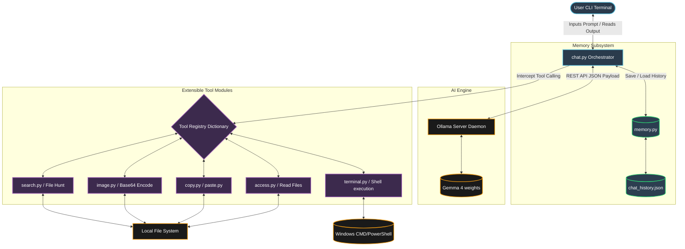

# Ollama AI Agent Architecture

This document contains visual representations of how your local AI agent is structured, and how data moves through it during runtime. 

## High-Level Block Diagram

This block diagram illustrates the major components of your system. You can see how the central orchestrator (`chat.py`) acts as a bridge between your local Operating System, the persistent memory module, and the Ollama AI server.

 

---

 

## Workflow Execution Sequence

This sequence diagram maps out the "Agentic Loop" discussed earlier. It tracks exactly what happens millisecond-by-millisecond when you submit a prompt to the terminal.

```mermaid
sequenceDiagram
    autonumber
    actor User
    participant Chat as chat.py
    participant Mem as memory.py
    participant Ollama as Ollama API
    participant Tools as Extensible Tools
    participant OS as System / Shell

    User->>Chat: Submits Prompt (e.g. "Where is python installed?")
    
    rect rgb(30, 40, 50)
    Note over Chat, Mem: Pre-Processing Phase
    Chat->>Mem: Append user message to history
    Mem-->>Chat: Enforce Sliding Window (Trim if > 30 msgs)
    end
    
    loop Autonomous Execution Loop
        rect rgb(40, 30, 40)
        Note over Chat, Ollama: AI Inference Phase
        Chat->>Ollama: POST messages array + Tool JSON schema
        activate Ollama
        
        alt Decision: Normal Text Reply
            Ollama-->>Chat: Stream normal text
            Chat-->>User: Print response to console
        else Decision: Invoke a Tool
            Ollama-->>Chat: Output intercepted! Returns function name & args
            deactivate Ollama
        end
        end

        rect rgb(30, 50, 40)
        Note over Chat, OS: Physical Execution Phase (If tool invoked)
        Chat->>Tools: Execute matched Python function
        activate Tools
        Tools->>OS: Perform action (os.walk, subprocess.run, etc.)
        OS-->>Tools: Return raw bytes / stdout
        Tools-->>Chat: Return structured text / base64 image dict
        deactivate Tools
        
        Chat->>Mem: Append tool output to chat history as "tool" role
        Note right of Chat: Loop restarts automatically so the AI can read the tool output!
        end
    end
    
    Chat->>Mem: Save final conversation state to JSON
```

> **Note:** The **Autonomous Execution Loop** ensures that if the agent runs a tool and determines it needs *more* information based on what the tool output, it can natively decide to trigger a second tool before ever talking to the user.
